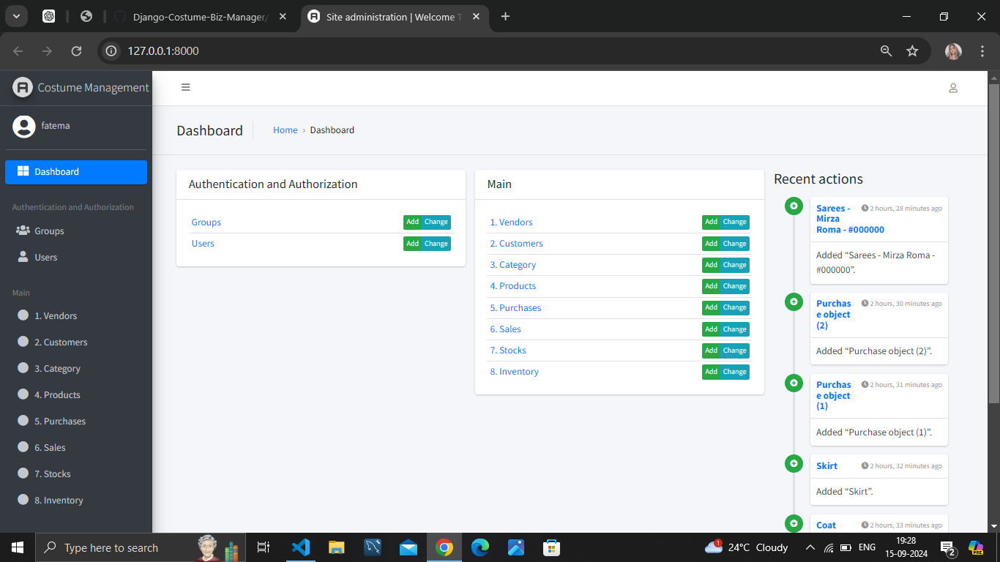

# Django-Costume-Biz-Manager

**Django-Costume-Biz-Manager** is a comprehensive Costume Business Management System built with Django. It provides an admin panel for managing vendors, customers, costume categories, products, purchases, sales, available stocks, and inventory tables.



## Features

- **Vendor Management**: Manage and track vendors.
- **Customer Management**: Manage customer details and interactions.
- **Costume Categories**: Define and manage different costume categories.
- **Product Management**: Add and manage costume products.
- **Purchase Management**: Track and manage purchases.
- **Sales Management**: Handle sales transactions and records.
- **Available Stocks**: Monitor stock levels and availability.
- **Inventory Management**: Oversee inventory data and updates.

## Prerequisites

Before running the application, ensure you have the following installed:

- Python 3.x
- pip (Python package installer)
  
## Installation

Follow these steps to set up and run the Django-Costume-Biz-Manager project on your local machine:

1. **Clone the Repository**

   ```bash
   git clone https://github.com/Baig-fatema/Django-Costume-Biz-Manager.git
   ```
 2. **Navigate to the Project Directory**

    ```bash
    cd Django-Costume-Biz-Manager
    ```
 3. **Create a Virtual Environment**

    ```bash
    python -m venv venv
    ```
 4. **Activate the Virtual Environment**

      - **On Windows:**
    
      ```bash
      venv\Scripts\activate
      ```
      - **On macOS/Linux:**
   
        ```bash
        source venv/bin/activate
        ```
  5. **Install the Required Packages**
     
        ```bash
        pip install -r requirements.txt
        ```
   6. **Create the Superuser**

      ```bash
      python manage.py createsuperuser
      ```
   7. **Make Migrations**

      ```bash
      python manage.py makemigrations
      ```
  8. **Apply Migrations**

     ```bash
     python manage.py migrate
     ```
  9. **Run the Development Server**

     ```bash
     python manage.py runserver
     ```

### Usage
1. **Access the Admin Panel**

   Open your web browser and navigate to http://127.0.0.1:8000  Log in using the superuser credentials you       created.

2. **Manage Vendors**

   Use the admin panel to add, edit, or delete vendor information.

3. **Manage Customers**

   Add and manage customer details and records through the admin interface.

4. **Define Costume Categories**

   Create and organize costume categories for better product management.

5. **Manage Products**

   Add new products, update existing ones, and manage product details.

6. **Track Purchases**

   Record and monitor purchases from vendors to keep track of inventory.

7. **Record Sales**

   Manage sales transactions and update sales records.

8.**Monitor Available Stocks**

   Check and update the availability of stock for each product.

9. **Oversee Inventory**

   Use inventory tables to manage and update inventory information.

### License
This project is licensed under the MIT License. See the LICENSE file for details.

### Contact
For questions or feedback, reach out to mirzafatmabaig1012@gmail.com.

### Author
[Baig-Fatem](https://github.com/Baig-fatema)
  
     

        
      
      
    
      

